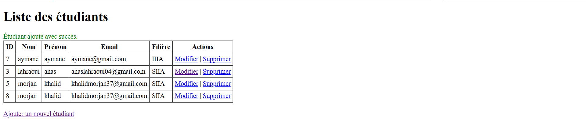
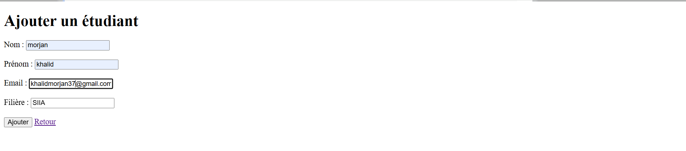

<div align="center">

# 🎓 SecureStudentMS

**Système de gestion d'étudiants sécurisé en PHP — admin, espace étudiant, modules, notes, dashboard analytique et console SQL.**


</div>

---

## 📋 Table des matières

1. [Aperçu](#-aperçu)
2. [Captures d'écran](#-captures-décran)
3. [Fonctionnalités](#-fonctionnalités)
4. [Démarrage rapide](#-démarrage-rapide)
5. [Architecture](#-architecture)
6. [Stack technique](#-stack-technique)
7. [Schéma de base de données](#-schéma-de-base-de-données)
8. [Routes](#-routes)
9. [Sécurité](#-sécurité)
10. [Rôles utilisateurs](#-rôles-utilisateurs)
11. [Configuration](#-configuration)
12. [Contribution](#-contribution)
13. [Licence](#-licence)
14. [Auteur](#-auteur)

---

## 🌟 Aperçu

**SecureStudentMS** est une application web complète de gestion d'étudiants
développée en **PHP 8.2 pur** (sans framework), avec une architecture
**MVC-inspirée**. Elle expose deux interfaces distinctes — *administrateur* et
*étudiant* — et privilégie deux axes : la **sécurité** (CSRF, rate limiting,
CSP nonce, bcrypt, headers HTTP, honeypot, hash de décoy) et **l'expérience
utilisateur** (dark mode soigné, recherche serveur, pagination, charts
interactifs, transitions fluides).

> Projet réalisé dans le cadre d'un projet de fin d'études, conçu pour
> démontrer la maîtrise des bonnes pratiques PHP modernes : routing par
> contrôleur frontal, requêtes préparées PDO, séparation des responsabilités,
> et hardening systématique.

---

## 📸 Captures d'écran

| Page d'accueil | Ajout d'étudiant |
| :---: | :---: |
|  |  |

> Captures du dashboard, de la console SQL, de l'espace étudiant et du dark
> mode disponibles dans `/screenshots`.

---

## ✨ Fonctionnalités

### 👤 Administrateur

- 🔐 **Authentification sécurisée** — bcrypt, CSRF, rate limiter (5 tentatives / min puis blocage 5 min), session fixation defence
- 👥 **CRUD étudiants** complet (ajout, modification, suppression, liste)
- 🔎 **Recherche serveur** sur nom / prénom / email + filtre par filière + tri par colonne + pagination
- 📚 **CRUD modules** avec inscription automatique des étudiants de la filière
- 📝 **Saisie des notes** — interface bulk avec aperçu live du statut (`note ≥ 10 → validé`, sinon `échoué`), avertissement *unsaved changes*
- 📊 **Dashboard analytique** — KPIs, bar chart répartition par filière, line chart des inscriptions sur 12 mois (Chart.js, thème adaptatif)
- 💻 **Console SQL** — exécute toute requête (SELECT, INSERT, UPDATE, DELETE, DDL), modal de confirmation pour les requêtes destructives, export CSV des résultats
- 🌓 **Dark mode** GitHub-inspired, transition fluide, scrollbar themée

### 🎓 Étudiant

- 🔐 **Connexion par email** + bcrypt + rate limiter
- 🏠 **Dashboard personnel** — modules inscrits, validés, échoués, moyenne générale
- 📚 **Liste des modules** de sa filière, regroupés par semestre, avec barre de progression
- ✍️ **Auto-inscription** aux modules de sa filière
- 👤 **Profil** — infos personnelles + changement de mot de passe sécurisé
- 🎨 **UI dédiée** — palette teal, navigation horizontale, identité visuelle distincte de l'admin

### 🛡️ Sécurité

- ✅ Protection **CSRF** sur tous les formulaires (`hash_equals` timing-safe)
- ✅ **Rate limiting** par IP + action (login, ajout, suppression, sauvegarde notes)
- ✅ **Content Security Policy** stricte avec nonce par requête
- ✅ **Headers HTTP** : X-Frame-Options, X-Content-Type-Options, Referrer-Policy, Permissions-Policy
- ✅ **Sessions hardenées** : `HttpOnly`, `SameSite=Strict`, `use_strict_mode`, regeneration sur connexion
- ✅ **Validation des entrées** + échappement systématique en sortie (`e()`)
- ✅ **Requêtes préparées PDO** partout — zéro concaténation SQL
- ✅ Champ **honeypot** sur les formulaires d'écriture (faux succès silencieux)
- ✅ **Hash de décoy** sur les logins (anti-énumération par timing)
- ✅ `.htaccess` bloquant l'accès direct à `config/`, `includes/`, `pages/`
- ✅ Vérification **propriété par enregistrement** (`WHERE id = ? AND etudiant_id = ?`)

---

## 🚀 Démarrage rapide

### Prérequis

| Logiciel | Version minimum |
| --- | --- |
| **XAMPP** | 8.2 (Apache + PHP + MySQL) |
| **PHP** | 8.2+ avec extensions `pdo_mysql`, `mbstring`, `json` |
| **MySQL** | 8.0+ ou MariaDB 10.6+ |
| **Navigateur** | Chrome / Firefox / Edge / Safari récent |

### Installation

```bash
# 1. Cloner le dépôt dans htdocs
cd C:\xampp\htdocs
git clone https://github.com/<your-user>/SecureStudentMS.git
cd SecureStudentMS

# 2. Démarrer Apache + MySQL depuis le panneau XAMPP

# 3. Créer la base de données (via phpMyAdmin ou mysql CLI)
mysql -u root -e "CREATE DATABASE gestion_etudiants CHARACTER SET utf8mb4 COLLATE utf8mb4_unicode_ci;"

# 4. Importer le schéma initial (étudiants seulement)
mysql -u root gestion_etudiants < database/schema.sql

# 5. Installer la table admins + créer l'admin par défaut
php database/install_auth.php

# 6. Installer l'auth étudiant + le catalogue de modules
php database/install_student_auth.php
```

### Accès

| Interface | URL | Identifiants par défaut |
| --- | --- | --- |
| **Admin** | <http://localhost/SecureStudentMS/public/?page=login> | `admin` / `admin123` |
| **Étudiant** | <http://localhost/SecureStudentMS/public/?page=etudiant/login> | *email étudiant* / `etudiant123` |

> ⚠️ **Changez les mots de passe par défaut immédiatement** après la première connexion.

---

## 🏗️ Architecture

Architecture **MVC-inspirée** : un contrôleur frontal unique
(`public/index.php`) route toutes les requêtes vers un fichier de page,
chaque page orchestre son propre cycle (auth → validation → I/O DB → vue).
Les *includes* fournissent les briques transverses (sécurité, helpers,
rate limiter, layout).

```
SecureStudentMS/
├── 📁 config/
│   └── config.php                ← credentials DB, constantes globales, PDO singleton
├── 📁 database/
│   ├── install_auth.php          ← seed admin (CLI)
│   └── install_student_auth.php  ← seed modules + auth étudiant (CLI)
├── 📁 includes/
│   ├── auth.php                  ← login_admin, logout_admin, require_auth
│   ├── etudiant_auth.php         ← équivalent pour les étudiants (clés session séparées)
│   ├── helpers.php               ← e(), redirect(), build_url(), paginate(), sort_icon(), CSRF
│   ├── rate_limiter.php          ← rate-limit fichier (sys_get_temp_dir)
│   ├── security.php              ← send_security_headers(), abort(), configure_session()
│   ├── header.php / footer.php   ← layout admin (sidebar)
│   └── etudiant_header.php / etudiant_footer.php  ← layout étudiant (top-nav teal)
├── 📁 pages/
│   ├── 📁 etudiant/              ← scope étudiant
│   │   ├── login.php / logout.php
│   │   ├── dashboard.php
│   │   ├── modules.php
│   │   └── profil.php
│   ├── login.php / logout.php    ← scope admin
│   ├── dashboard.php             ← stats + charts Chart.js
│   ├── index.php                 ← liste étudiants (search/filter/sort/paginate)
│   ├── ajouter.php / modifier.php / supprimer.php
│   ├── modules.php / modules_ajouter.php / modules_modifier.php / modules_supprimer.php
│   ├── notes.php / notes_etudiant.php   ← saisie des notes en bulk
│   └── sql.php                   ← console SQL (toute requête, confirmation modal)
├── 📁 public/                    ← document root
│   ├── index.php                 ← front controller (routing + auth gate global)
│   ├── 📁 css/style.css          ← design system + dark mode + tous les composants
│   └── 📁 js/app.js              ← dark mode, charts, console SQL, dirty-tracking notes
├── 📁 screenshots/
├── .htaccess                     ← Options -Indexes, blocage extensions sensibles
├── README.md
└── index.php                     ← redirige vers public/
```

### Patterns appliqués

- **Front controller** — `public/index.php` whitelist les routes, dispatche vers `pages/{route}.php`
- **PRG (Post / Redirect / Get)** — toutes les écritures redirigent après succès, refresh ne re-soumet pas
- **Layout includes** — `header.php` + page + `footer.php` (deux variantes : admin vs étudiant)
- **Session keys disjoints** — `admin_id` vs `etudiant_id` rendent l'élévation de privilège impossible
- **Auth cache TTL** — `require_auth` revérifie en BDD toutes les 5 min, sinon trust session
- **Helpers globaux** — `e()` pour XSS, `paginate()` / `build_url()` / `sort_icon()` pour les listes

---

## 🛠️ Stack technique

| Catégorie | Technologie | Version | Usage |
| --- | --- | :---: | --- |
| **Backend** | PHP | 8.2 | Logique serveur, types stricts (`declare(strict_types=1)`) |
| **Base de données** | MySQL | 8.0 | Stockage relationnel, contraintes FK, ENUM |
| **Accès BDD** | PDO | natif | Requêtes préparées, transactions, ERRMODE_EXCEPTION |
| **Front CSS** | Bootstrap | 5.3 | Grid, composants, utilitaires |
| **Front design** | CSS custom | — | Design tokens, dark mode, animations |
| **Charts** | Chart.js | 4.4 | Bar + line charts, thème dynamique |
| **Front JS** | Vanilla JS | ES2017+ | Aucune dépendance, IIFE pattern, CSP-safe |
| **Icônes** | Bootstrap Icons | 1.11 | Iconographie cohérente |
| **Typographie** | Inter (Google Fonts) | — | Font moderne, lisible, variable |
| **Serveur** | Apache | 2.4 | XAMPP, `.htaccess` pour le hardening |

---

## 🗄️ Schéma de base de données

### Diagramme

```
┌──────────────────┐       ┌──────────────────┐       ┌──────────────────┐
│     admins       │       │    etudiants     │       │     modules      │
├──────────────────┤       ├──────────────────┤       ├──────────────────┤
│ id (PK)          │       │ id (PK)          │       │ id (PK)          │
│ username (UQ)    │       │ nom              │       │ code (UQ)        │
│ password_hash    │       │ prenom           │       │ nom              │
│ full_name        │       │ email (UQ)       │       │ description      │
│ last_login       │       │ password_hash    │       │ credits          │
│ created_at       │       │ is_active        │       │ semestre         │
└──────────────────┘       │ last_login       │       │ filiere          │
                           │ filieres         │       │ created_at       │
                           │ created_at       │       └────────┬─────────┘
                           └─────────┬────────┘                │
                                     │                         │
                                     │   ┌──────────────────┐  │
                                     │   │   inscriptions   │  │
                                     │   ├──────────────────┤  │
                                     └──►│ etudiant_id (FK) │◄─┘
                                         │ module_id (FK)   │
                                         │ note (DEC 4,2)   │
                                         │ statut (ENUM)    │
                                         │ inscribed_at     │
                                         │ UNIQUE(et,mod)   │
                                         └──────────────────┘
```

### Tables

#### `admins`
Comptes administrateurs. Mot de passe en bcrypt (`PASSWORD_DEFAULT`),
`last_login` mis à jour à chaque connexion.

#### `etudiants`
Comptes étudiants + données métier. Le champ `is_active` permet la
désactivation sans suppression. La filière est dénormalisée (varchar) pour
simplicité — une vraie école ferait une table `filieres` séparée.

#### `modules`
Catalogue des cours. `code` unique (ex. `INF101`), `credits` ECTS,
`semestre` 1-6, `filiere` rattachant le module à une promo.

#### `inscriptions`
Table de liaison `etudiants × modules` portant la **note** et le **statut**
(`inscrit` / `valide` / `echoue`). Clés étrangères en cascade pour la
cohérence référentielle. Contrainte `UNIQUE(etudiant_id, module_id)` —
un étudiant ne peut être inscrit qu'une fois à un module.

---

## 🛣️ Routes

Toutes les routes passent par le contrôleur frontal `public/index.php` qui
applique une whitelist stricte — toute valeur hors-liste retombe sur
`?page=index`.

### Scope admin

| Route | Page | Rôle |
| --- | --- | --- |
| `?page=login` | `login.php` | Connexion admin (publique) |
| `?page=logout` | `logout.php` | Déconnexion (POST + CSRF) |
| `?page=dashboard` | `dashboard.php` | KPIs + charts |
| `?page=index` | `index.php` | Liste étudiants |
| `?page=ajouter` | `ajouter.php` | Ajouter un étudiant |
| `?page=modifier&id=N` | `modifier.php` | Éditer un étudiant |
| `?page=supprimer&id=N` | `supprimer.php` | Supprimer un étudiant |
| `?page=modules` | `modules.php` | Liste modules + filtres |
| `?page=modules_ajouter` | `modules_ajouter.php` | Créer un module + auto-inscription |
| `?page=modules_modifier&id=N` | `modules_modifier.php` | Éditer un module + sync inscriptions |
| `?page=modules_supprimer&id=N` | `modules_supprimer.php` | Supprimer un module |
| `?page=notes` | `notes.php` | Liste étudiants à noter |
| `?page=notes_etudiant&id=N` | `notes_etudiant.php` | Saisie des notes |
| `?page=sql` | `sql.php` | Console SQL avec confirmation |

### Scope étudiant

| Route | Page | Rôle |
| --- | --- | --- |
| `?page=etudiant/login` | `etudiant/login.php` | Connexion étudiant (publique) |
| `?page=etudiant/logout` | `etudiant/logout.php` | Déconnexion (POST + CSRF) |
| `?page=etudiant/dashboard` | `etudiant/dashboard.php` | Stats personnelles |
| `?page=etudiant/modules` | `etudiant/modules.php` | Modules de sa filière |
| `?page=etudiant/profil` | `etudiant/profil.php` | Profil + change mot de passe |

---

## 🔒 Sécurité

L'application a été conçue avec un modèle de menace explicite. Chaque vecteur
identifié est mitigé par au moins un mécanisme spécifique.

### Matrice de menaces

| Menace | Mitigation |
| --- | --- |
| **Injection SQL** | Requêtes préparées PDO + colonnes `ORDER BY` en allowlist |
| **XSS** | Échappement systématique via `e()` (htmlspecialchars UTF-8) en sortie |
| **CSRF** | Token cryptographique en session + `hash_equals` timing-safe + cookie `SameSite=Strict` |
| **Force brute (login)** | Rate limiter fichier — 5 tentatives / min puis blocage 5 min |
| **Énumération d'utilisateurs** | Hash de décoy bcrypt joué quand l'utilisateur n'existe pas (constant-time) |
| **Détournement de session** | `session_regenerate_id(true)` à la connexion + UA pinning + `HttpOnly` + `SameSite=Strict` |
| **Fixation de session** | ID régénéré au premier *hit* + après chaque login |
| **Clickjacking** | `X-Frame-Options: DENY` + CSP `frame-ancestors 'none'` |
| **MIME sniffing** | `X-Content-Type-Options: nosniff` |
| **Injection d'en-têtes** | `Content-Security-Policy` strict avec nonce généré par requête |
| **Accès direct aux fichiers** | `.htaccess Require all denied` sur `config/`, `includes/`, `pages/` |
| **Bots** | Champ honeypot invisible — silencieux faux succès si rempli |
| **Logout forcé via GET** | Endpoint `logout` accepte uniquement POST + CSRF |
| **Élévation de privilège** | Clés de session disjointes (`admin_id` vs `etudiant_id`) |
| **Tampering d'identifiants** | Vérification `WHERE id = ? AND etudiant_id = ?` côté écriture |
| **Erreurs trop verbeuses** | `error_log()` côté serveur, message générique côté client |

### Gestion des secrets

- Mots de passe stockés via `password_hash($pw, PASSWORD_DEFAULT)` (bcrypt cost 10)
- `password_needs_rehash()` upgrade transparent à la connexion suivante
- Aucun mot de passe en clair dans les logs ni les sessions

---

## 👥 Rôles utilisateurs

| Rôle | Capacités | URL d'entrée |
| --- | --- | --- |
| **Admin** | Accès complet (dashboard, étudiants, modules, notes, SQL) | `?page=login` |
| **Étudiant** | Lecture seule de ses propres données + auto-inscription + change mdp | `?page=etudiant/login` |
| **Visiteur non-authentifié** | Redirigé vers le login correspondant à la page demandée | — |

---

## ⚙️ Configuration

Toutes les constantes vivent dans `config/config.php` :

```php
const DB_HOST    = 'localhost';
const DB_NAME    = 'gestion_etudiants';
const DB_USER    = 'root';
const DB_PASS    = '';
const DB_CHARSET = 'utf8mb4';

const APP_NAME = 'Gestion des étudiants';
const APP_ENV  = 'development';   // 'development' | 'production'
const BASE_URL = '/SecureStudentMS/public/';
```

### Mode production

En production (`APP_ENV = 'production'`) :

- `display_errors = 0`, les erreurs ne fuient plus côté client
- `session.cookie_secure = 1` exige HTTPS
- Messages d'erreur SQL génériques côté utilisateur
- Logging activé via `error_log`

> Pensez aussi à activer HTTPS au niveau Apache et à mettre à jour la CSP
> pour vos domaines réels.

---

## 🤝 Contribution

Les contributions sont les bienvenues. Procédure standard :

```bash
# 1. Fork du dépôt
# 2. Crée ta branche
git checkout -b feature/ma-fonctionnalite

# 3. Commit (messages clairs, en anglais ou français cohérent avec l'historique)
git commit -m "feat: add <description>"

# 4. Push
git push origin feature/ma-fonctionnalite

# 5. Ouvre une Pull Request
```

### Standards de code

- `declare(strict_types=1)` sur tout fichier PHP nouveau
- 4 espaces d'indentation, UTF-8 sans BOM
- Tout output passe par `e()`
- Toute requête DB en `try/catch` avec `error_log` + `abort(500)`
- Zéro JS inline (CSP)
- Helpers à utiliser : `paginate()`, `build_url()`, `sort_icon()`, `csrf_token_field()`, `honeypot_field()`

---

## 📄 Licence

Distribué sous licence **MIT**. Voir [LICENSE](LICENSE) pour le détail.

```
MIT License — Copyright (c) 2025 Khalid MORJANE
```

---

## 👨‍💻 Auteur

<div align="center">

**Khalid MORJANE**

*Projet de fin d'études — Système de gestion d'étudiants PHP / MySQL*

[](https://github.com/)

</div>

---

<div align="center">

**Si ce projet vous a été utile, n'hésitez pas à laisser une ⭐ sur le dépôt.**

</div>
